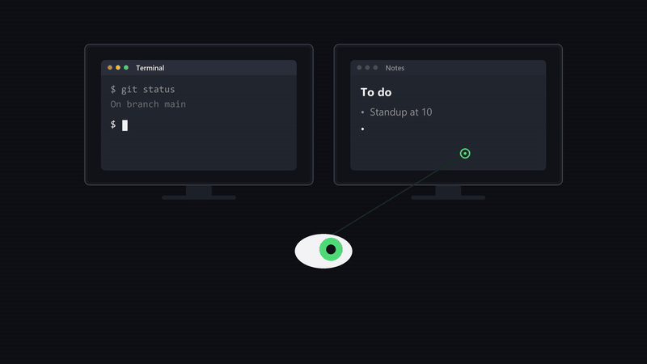

# gazefocus

[](https://github.com/Mat8313/gazefocus/actions/workflows/tests.yml)

[](docs/demo.mp4)

*Clique sur l'animation pour la vidéo avec le son (23 secondes).*

*Keyboard focus follows the screen you look at, on Windows. The app runs in the
notification area, works fully offline from your webcam, and its interface is in
English or French depending on your Windows language. The rest of this page is
in French.*

Le focus clavier suit l'écran que tu regardes, sous Windows. Tourne la tête vers
ton autre moniteur et tape : la dernière fenêtre utilisée sur cet écran a déjà
le focus, sans clic.

L'application reste en arrière-plan, avec une icône dans la zone de
notification.

Tout tourne en local : la webcam est analysée en mémoire avec MediaPipe, aucune
image n'est enregistrée ni envoyée. La seule requête réseau est le
téléchargement du modèle de visage (environ 4 Mo) au premier lancement.

## Installation

Depuis la page [Releases](https://github.com/Mat8313/gazefocus/releases), au
choix :

- `gazefocus-setup.exe` : installeur sans droits administrateur, avec raccourci
  dans le menu Démarrer et désinstallation propre (à partir de la version 0.4.0) ;
- `gazefocus-windows.zip` : à décompresser où tu veux, puis lancer
  `gazefocus.exe`.

Aucun Python à installer. Il faut Windows 10/11 en 64 bits, une webcam et au
moins deux écrans.

Comme l'exe n'est pas signé, Windows SmartScreen peut afficher un
avertissement au premier lancement : « Informations complémentaires », puis
« Exécuter quand même ».

## Utilisation

Au premier lancement, la calibration démarre toute seule, en deux étapes :

1. Assis comme d'habitude : sur chaque écran, appuie sur Espace puis suis des
   yeux le point qui longe les bords et traverse le milieu, pendant 14 secondes.
2. Recule ta chaise d'environ 25 cm et recommence. Cette étape apprend à l'app
   comment la distance change les angles ; la touche S permet de la passer.

Chaque disposition d'écrans (portable seul, portable + écran externe...) garde
sa propre calibration, reprise automatiquement quand tu rebranches.

Menu de l'icône (clic droit) :

- **Pause / Reprendre** : aussi par clic gauche sur l'icône ou `Ctrl+Alt+G`.
  En pause, la caméra est libérée.
- **Calibrer les écrans** : à refaire si tu déplaces un écran ou la webcam.
- **Réglages…** : voir ci-dessous.
- **Lancer au démarrage de Windows** : disponible dans la version `.exe`.
- **Quitter**

Couleur de l'iris : vert actif, gris en pause, bleu en calibration, orange
calibration à refaire ou caméra indisponible, rouge erreur.

### Réglages

| Réglage | Défaut | Effet |
| --- | --- | --- |
| Caméra | 0 | Index de la webcam à utiliser |
| Temps de fixation | 0,3 s | Durée à regarder un écran avant la bascule |
| Focus après une frappe | 3 s | Pas de bascule tant que tu tapes |
| Focus après la souris | 1,5 s | La souris garde la main |
| Affiner à chaque clic | oui | Chaque clic sert d'échantillon de calibration |
| Amener le curseur | non | Le pointeur va sur la fenêtre qui reçoit le focus |
| Tenir compte des yeux | oui | Ajoute la position des iris ; recalibrer après un changement |
| Fenêtres d'un même écran | non | Expérimental : bascule entre fenêtres voisines |
| Entourer la fenêtre regardée | non | Contour vert si elle a le focus, orange si la bascule est en attente |
| Applications exclues | aucune | Le focus ne bouge jamais seul devant ces apps (ex. `vlc.exe`) |

Les réglages sont dans `%APPDATA%\gazefocus\config.json`.

## Lancer depuis les sources

Python 3.10 ou plus.

```
python -m venv .venv
.venv\Scripts\activate
pip install -r requirements.txt
python -m gazefocus
```

## Construire l'exe

```
pip install pyinstaller
.\build.ps1
```

Le résultat est le dossier `dist\gazefocus` (environ 210 Mo, surtout OpenCV et
MediaPipe). Pour l'installeur, avec [Inno Setup](https://jrsoftware.org/isinfo.php) :

```
iscc /DAppVersion=0.4.0 installer.iss
```

Sur GitHub, pousser un tag `vX.Y.Z` construit le zip et l'installeur et les
attache à la release (`.github/workflows/release.yml`).

## Comment ça marche

1. `tracker.py` : MediaPipe estime l'orientation et la position de la tête,
   ainsi que le décalage des iris dans les yeux. Un filtre « One Euro »
   (`smoothing.py`) lisse le tout : fort au repos, léger en mouvement.
2. `gaze.py` : chaque écran a des échantillons « pose -> position ». Une
   régression ridge par écran en tire le point regardé ; l'écran choisi est
   celui dans lequel ce point tombe, avec une marge en faveur de l'écran actuel
   pour éviter le ping-pong. Le poids des yeux par rapport à la tête est donc
   appris pour chaque personne. Des termes « angle × distance » compensent le
   recul ou l'avancée de la chaise.
3. `calibration.py` fournit les échantillons de départ (environ 150 par
   écran) ; ensuite chaque clic en ajoute un, parce qu'on regarde là où on
   clique. Les 200 derniers clics par écran sont gardés, les plus récents
   pesant le plus.
4. `decision.py` : la bascule n'a lieu qu'après un regard soutenu, jamais
   pendant que tu tapes ou que tu utilises la souris.
5. `winfocus.py` : la fenêtre la plus haute dans le z-order de l'écran visé
   reçoit le focus via l'API Win32.
6. `engine.py` fait tourner le tout dans un thread, `tray.py` gère l'icône,
   `settings_ui.py` la fenêtre de réglages.

L'app se met en veille quand la session est verrouillée ou qu'il n'y a qu'un
seul écran, et réessaie toutes les 5 secondes si la caméra est indisponible.
Elle traite 20 images par seconde quand ton regard bouge et 5 quand il est
posé. Si l'erreur mesurée sur tes 20 derniers clics dépasse un quart d'écran,
une notification te propose de recalibrer.

## Limites

- Le suivi des yeux reste approximatif avec une webcam ordinaire : il dépend
  de l'éclairage, et les lunettes à reflets le dégradent.
- La bascule entre fenêtres d'un même écran demande une précision que la
  webcam n'offre pas toujours ; elle convient à deux fenêtres côte à côte.
- Les fenêtres lancées en administrateur ne peuvent pas recevoir le focus
  depuis un processus normal.

## Tests

```
pip install pytest
python -m pytest
```

## Licence

MIT, voir [LICENSE](LICENSE).
